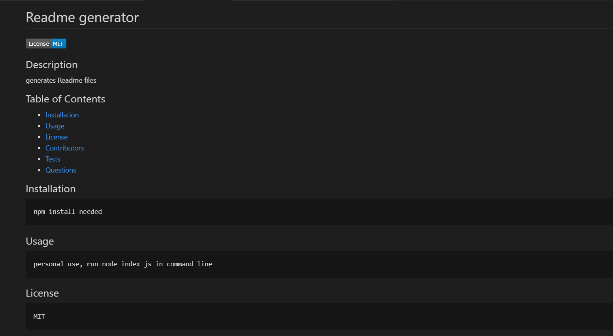
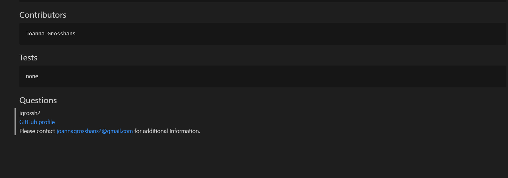

# READme Generator

## Description

READme generator was created in order to streamline the process of creating a Readme.md file. Each project in a user's respository includes a Readme in order to display the project's functionality and code features. Because of the importance of this file, having a generator to input information is very useful. The user will be prompted in the command line about the project name, project description, usage, installation and test instructions, contributions, license information, and user contact information. Within the Readme, there are links to the Github profile and contact email, as well as a functional table of contents with links to navigate the Readme file efficiently. Please look at this link for a screencasify demonstration. [screencastify Readme-generate](https://drive.google.com/file/d/1Nob_4kZyicROzRZaAwp0xqiwG8DA6afj/view).

## Images 
  

## Installation
    Node and NPM install inquirer
## Usage
    for personal use, run "node index js" in the command line
## License
    none
## Contributors
    Joanna Grosshans, creator
## Tests
    none
## Questions
jgrossh2  
[GitHub](https://github.com/jgrossh2/readme-generate)  
Please contact <joannagrosshans2@gmail.com> for additional Information.

# Technologies used
 *JS  
 *Node 